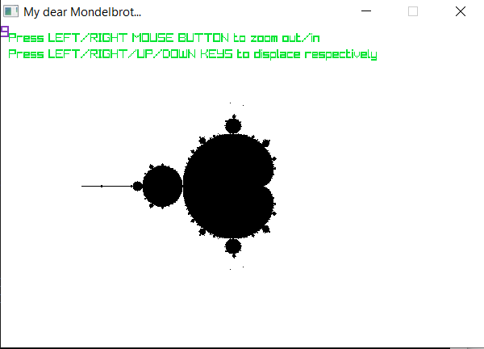
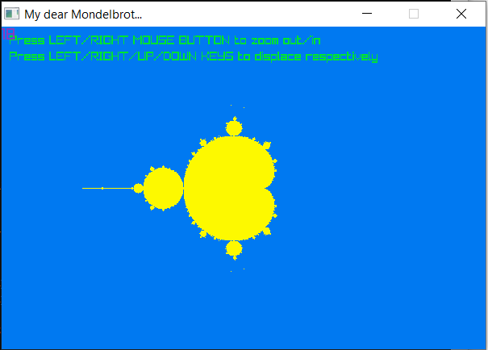

# Mandelbrot's set optimisation with intrinsics

* Intrincics instruction set: *AVX & AVX2* ([mirror for Russia](https://www.laruence.com/sse/))
* Graphic library: [*raylib*](raylib.com) 
* OS: *Window 10*

The Mandelbrot set is the set of complex numbers for which the function [f_c(z)=z^2 + c] does not diverge to infinity when iterated from z=0

In my case i considered as belonging to set all points that do not leave circle of radius R = 10 after 256 steps

I used raylib library to visualise it, thus i got:

**Without optimization FPS oscillates about 15 FPS**:

**With AVX intinsics optimization FPS oscillates about 30 FPS**:

both programs were compiled with g++ using further flags (f.ex for avx.cpp):

``
g++ avx.cpp -o avx.exe -O2 -Wall -Wno-missing-braces -I include/ -L lib/ -lraylib -lopengl32 -lgdi32 -lwinmm -mavx -mavx2 
``

Also i computed "clear" benefit, not considering graphic drawing expenses:

  * No-AVX: 13 FPS
  
  * AVX: 50 FPS

It's a bit weird, but as i said with graphic FPS osciallated about 15 FPS, but i did not compute mean value.

In no_graphic way FPS = mean FPS considering 100 computing iterations 
